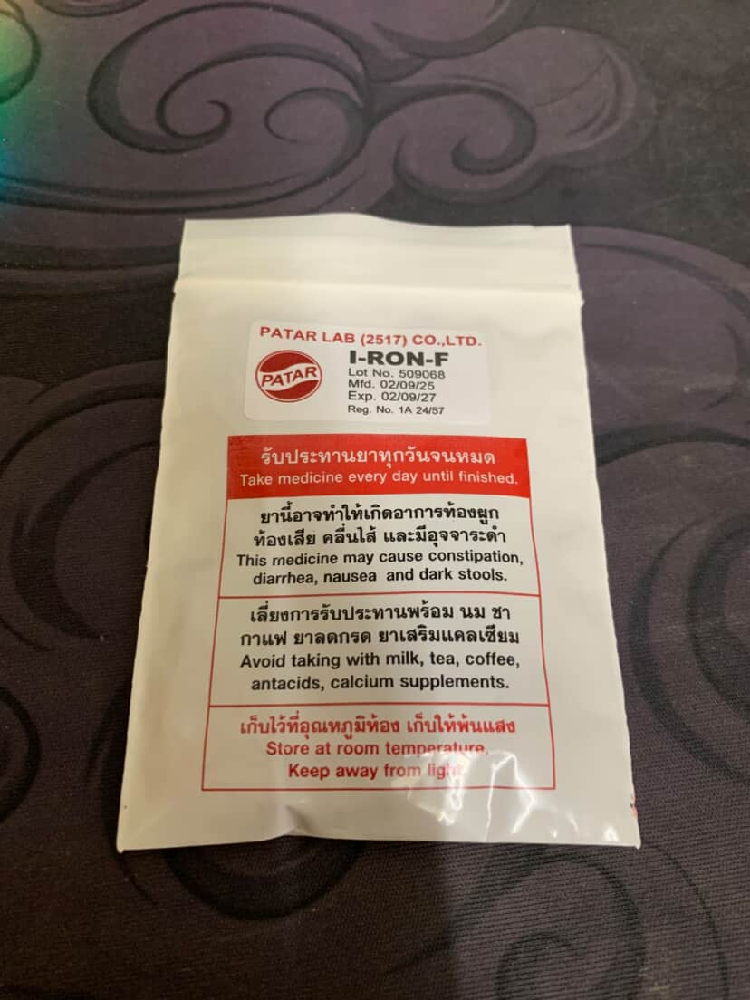
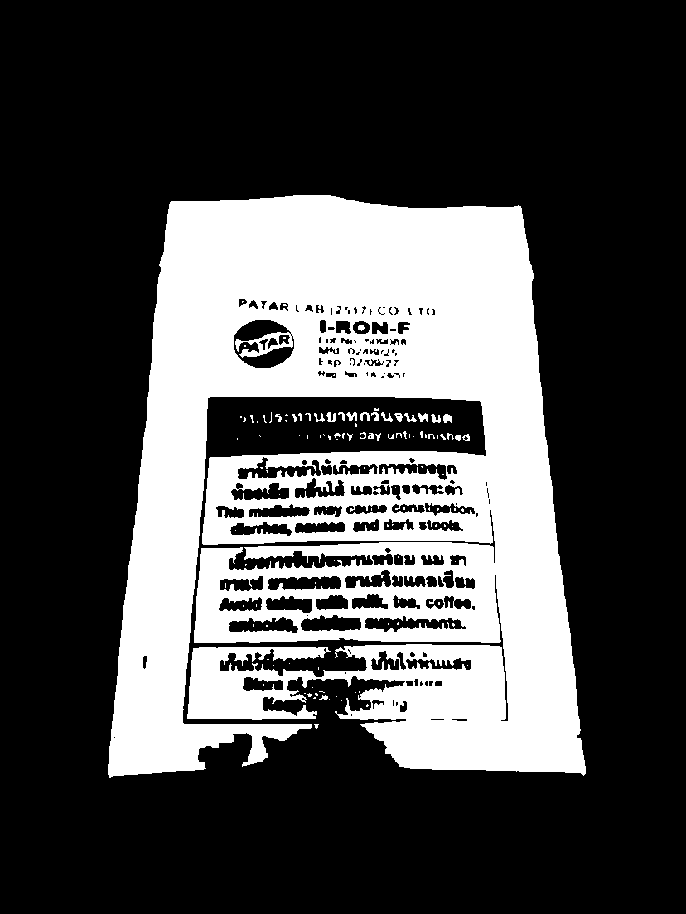

# 📸 Try Image Processing (Document Scanner Simulation)

โปรเจกต์ทดลองการทำ Image Processing พื้นฐานเพื่อจำลองระบบ **Document Scanner** โดยใช้ Python และ OpenCV เพื่อเปลี่ยนภาพถ่ายจากกล้องให้กลายเป็นภาพสแกนขาว-ดำที่คมชัด

---

## 🌟 Key Features
* **Grayscale Conversion:** แปลงภาพสีเป็นขาว-ดำเพื่อลดความซับซ้อนของข้อมูล
* **Gaussian Blurring:** การลบ Noise หรือจุดรบกวนในภาพเพื่อให้การประมวลผลแม่นยำขึ้น
* **Binary Thresholding:** การทำ Threshold เพื่อแยกส่วนข้อความออกจากพื้นหลัง (Document Scanning Effect)

---

## 🖼️ Results (Before & After)

| Input Image | Scanned Output |
| :---: | :---: |
|  |  |
| *ภาพถ่ายต้นฉบับ* | *ภาพหลังผ่านกระบวนการสแกน* |

---

## 🛠️ Tech Stack
* **Language:** Python
* **Library:** OpenCV (cv2)
* **Concepts:** Image Pre-processing, Binary Thresholding

---

## 📂 Project Structure
```text
try-image-processing/
├── 📁 images/
│   ├── 📁 input/
│   │   └── image.png          # ภาพต้นฉบับสำหรับการประมวลผล
│   └── 📁 output/
│       └── scanned.png        # ภาพผลลัพธ์หลังทำ Thresholding
├── 📁 src/
│   ├── main.py                # จุดรันโปรแกรมหลักและบันทึกภาพ
│   ├── preprocessing.py       # ฟังก์ชัน Gray, Blur และ Threshold
│   └── scanner.py             # Logic การจัดการ Workflow ของ Scanner
└── 📝 README.md               # เอกสารประกอบโปรเจกต์
```

---

## 🚀 How to Run
1. ติดตั้ง OpenCV: `pip install opencv-python`
2. รันโปรแกรมหลัก:
   ```bash
   python src/main.py

---

## 📝 Commit Message Guideline

เพื่อให้ประวัติการพัฒนา (Git History) อ่านง่ายและสื่อสารได้ชัดเจน โปรเจคนี้จะใช้มาตรฐาน **Conventional Commits** ดังนี้:

### Format
`type: description`

### Types
| Type | Description (ไทย) | Example |
| :--- | :--- | :--- |
| **feat** | เพิ่ม Test Case หรือ Feature ใหม่ | `feat: add login success test case` |
| **fix** | แก้ไข Script ที่ Fail หรือแก้ไข Bug | `fix: update locator for login button` |
| **docs** | แก้ไขหรืออัปเดตเอกสาร (README) | `docs: update commit guideline` |
| **refactor** | ปรับปรุงโค้ดให้ดีขึ้น (เช่น ยุบ Keyword) | `refactor: optimize api test structure` |
| **style** | แก้ไข Format โค้ด (Space, Indent) | `style: fix indentation in login.robot` |
| **chore** | งานจิปาถะ เช่น อัปเดต Library | `chore: update seleniumlibrary version` |

---